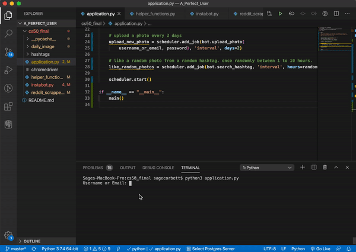
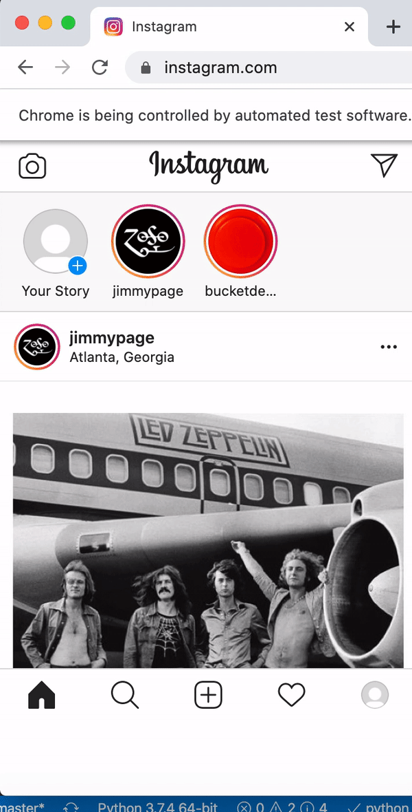

# A_Perfect_User
My Harvard CS50 final project. 

"A Perfect User" is a full featured bot that behaves like what I believe the ideal instagram user would. This python program logs into instagram and performs tasks such as:
 - Follow users.
 - Like an image randomly between every 1 to 10 hours.
 - Save the top image from reddit.com/r/pics along with the description and user who posted it then post it to instagram. This program does this every two days.

### Running this program
To run this program type: `python3 application.py` and type your instagram username and password into your terminal. You can also easily make changes in the `main()` function in `application.py` to change the frequency that the bot performs its tasks. in the background of your computer

### What makes this IG bot different from other Instagram bots?
This bot was not made to gain followers or likes but just behave like a normal person on Instagram. I also believe this bot to be the first ever made that is 100% Python/Selenium. The challenge is when uploading photos, all other bots seem to use AutoIt to handle the pop up window. But I was able to find a way to do it with just Selenium.

## Login

## Upload an Image

## Follow User

## Like a Random Image

